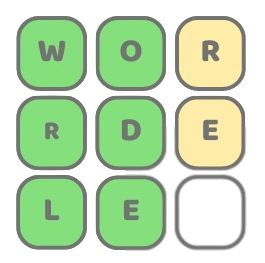

<div align="center">



### Wordle

#### A five-letter word guessing game for cell phones, developed with Flutter.

</div>

## Key Features

- Home Page
  - A random word is generated in each game and the aim of the game is to guess this word with a maximum of six chances.
- Statistics Page
  - On this page you can see all your statistics.
- Saving progress
  - The user will start the game where they left off last time.

## How To Use

To clone and run this application, you'll need Git and Flutter installed on your computer. From your command line:

```
# Clone this repository
$ git clone https://github.com/LucasSous/wordle.git

# Go into the repository
$ cd wordle

# Install dependencies
$ flutter pub get

# Run the app
$ flutter run
```

## The Technologies Used

- Flutter
- Dart
- MobX
- Modular
- Hive
